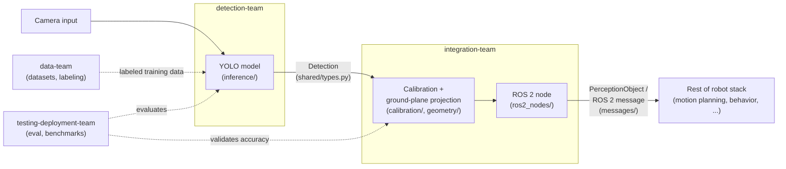

# Architecture

This describes how the four subteams' work fits together into one
perception pipeline, from camera frame to a position the rest of the
robot stack can act on.

## Pipeline overview

1. **Camera input** — a frame comes off the SUSTAINA-OP2's onboard
   camera.
2. **Detection** ([detection-team/](detection-team/)) runs the trained
   YOLO model on the frame and produces bounding-box detections (class,
   confidence, image-space box) for the ball, robots, goalposts, field
   lines, and landmarks. See `shared/types.py`'s `Detection`.
3. **Integration** ([integration-team/](integration-team/)) takes those
   detections and, using camera calibration and a ground-plane
   projection, converts each one into a robot-relative position. See
   `shared/types.py`'s `PerceptionObject`.
4. **Output** — integration-team publishes the resulting positions as
   ROS 2 perception messages, which the rest of the robot stack (motion
   planning, behavior, etc.) subscribes to.

Data-team ([data-team/](data-team/)) feeds detection-team with labeled
training data throughout, and testing-deployment-team
([testing-deployment-team/](testing-deployment-team/)) evaluates and
benchmarks both the detection model and the calibration/projection math,
and packages the final result.

## Diagram

## Where each subteam's code plugs in

| Stage | Subteam | Folder |
|---|---|---|
| Provide training data | data-team | `data-team/datasets/`, `data-team/scripts/` |
| Produce detections | detection-team | `detection-team/training/`, `detection-team/inference/` |
| Project to robot-relative positions | integration-team | `integration-team/calibration/`, `integration-team/geometry/` |
| Publish to the robot stack | integration-team | `integration-team/ros2_nodes/`, `integration-team/messages/` |
| Evaluate and package | testing-deployment-team | `testing-deployment-team/tests/`, `testing-deployment-team/benchmarks/`, `testing-deployment-team/deployment/` |
| Cross-cutting types/constants | shared | `shared/` |

See each subteam's own README for its semester roadmap and current
starting task.
