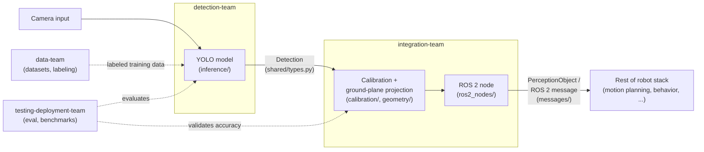
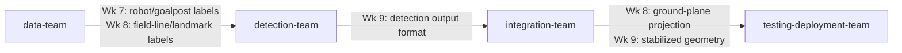

# Architecture

This describes how the four subteams' work fits together into one
perception pipeline, from camera frame to a position the rest of the
robot stack can act on.

## Pipeline status

What's actually implemented today, not the roadmap:

| Stage | Status | Notes |
|---|---|---|
| Shared types & config (`shared/`) | **Working** | `BoundingBox`, `Detection`, `Position2D`, `PerceptionObject` dataclasses and the YAML config loader are implemented and usable — see [Data contracts](#data-contracts) below. |
| Data pipeline (`data-team/`) | **Not started** | `scripts/download.py`, `convert.py`, `split.py`, `augment.py` exist as CLI skeletons (argument parsing only, bodies raise `NotImplementedError`). No dataset has been downloaded or processed yet. |
| Detection (`detection-team/`) | **Not started** | `training/train.py`, `training/eval.py`, `inference/detector.py` are skeletons; no model has been trained. [`scripts/quickstart.py`](scripts/quickstart.py) at the repo root runs a stock pretrained YOLO model directly as a stand-in — see its docstring for exactly what that does and doesn't prove. |
| Calibration (`integration-team/calibration/`) | **Not started** | `calibrate.py` is a skeleton; no camera has been calibrated. |
| Ground-plane projection (`integration-team/geometry/`) | **Not started** | `projection.py` is a skeleton. |
| ROS 2 packaging (`integration-team/ros2_nodes/`, `messages/`) | **Not started** | Node files and the message-conversion stub exist; no ROS 2 message schema has been defined yet. |
| Evaluation & benchmarking (`testing-deployment-team/`) | **Not started** | `tests/eval_harness.py`, `benchmarks/inference_speed.py`, `deployment/export_onnx.py` are skeletons. |

> **Keep this current:** if you implement a stage, update its row in
> this table in the same PR. A stale status table is worse than none.

## Pipeline overview

1. **Camera input** — a frame comes off the SUSTAINA-OP2's onboard
   camera.
2. **Detection** ([detection-team/](detection-team/)) runs the trained
   YOLO model on the frame and produces bounding-box detections (class,
   confidence, image-space box) for the ball, robots, goalposts, field
   lines, and landmarks. See [Data contracts](#data-contracts) below for
   the exact `Detection` shape.
3. **Integration** ([integration-team/](integration-team/)) takes those
   detections and, using camera calibration and a ground-plane
   projection, converts each one into a robot-relative position. See
   [Data contracts](#data-contracts) for the exact `PerceptionObject`
   shape.
4. **Output** — integration-team publishes the resulting positions as
   ROS 2 perception messages, which the rest of the robot stack (motion
   planning, behavior, etc.) subscribes to. **This message format isn't
   defined yet** — see [Data contracts](#data-contracts).

Data-team ([data-team/](data-team/)) feeds detection-team with labeled
training data throughout, and testing-deployment-team
([testing-deployment-team/](testing-deployment-team/)) evaluates and
benchmarks both the detection model and the calibration/projection math,
and packages the final result.

As the [Pipeline status](#pipeline-status) table above shows, this is
currently the intended design, not a description of working code — see
that table for what's actually implemented.

## Data contracts

These are the types every subteam should import rather than
redefining, from [`shared/types.py`](shared/types.py). This file is
real, implemented code (not a stub).

**`BoundingBox`**

| Field | Type | Description |
|---|---|---|
| `x_min` | `float` | Left edge, in image pixels |
| `y_min` | `float` | Top edge, in image pixels |
| `x_max` | `float` | Right edge, in image pixels |
| `y_max` | `float` | Bottom edge, in image pixels |

**`Detection`** — raw output from the detection model, in image space

| Field | Type | Description |
|---|---|---|
| `class_name` | `str` | One of `shared/classes.py`'s `CLASSES`: `ball`, `robot`, `goalpost`, `field_line`, `landmark` |
| `confidence` | `float` | Model confidence score, 0–1 |
| `bbox` | `BoundingBox` | Image-space bounding box |

**`Position2D`** — robot-relative position on the ground plane, in
meters

| Field | Type | Description |
|---|---|---|
| `x` | `float` | Meters, robot-relative. **Axis convention (which direction is +x, origin point) is not yet defined** — TODO for integration-team when ground-plane projection is implemented. |
| `y` | `float` | Meters, robot-relative. Same caveat as `x`. |

**`PerceptionObject`** — a `Detection` projected into robot-relative
world coordinates

| Field | Type | Description |
|---|---|---|
| `class_name` | `str` | Carried over from the source `Detection` |
| `confidence` | `float` | Carried over from the source `Detection` |
| `position` | `Position2D` | Projected ground-plane position |

**ROS 2 perception message:** **not yet defined.**
[`integration-team/messages/perception_message.py`](integration-team/messages/perception_message.py)
has a `to_ros_message(obj: PerceptionObject)` function stub, but no
actual ROS 2 message type/schema has been created — no `.msg` file, no
field list beyond what `PerceptionObject` already has above. Owned by
integration-team, planned for November (see
[integration-team/README.md](integration-team/README.md#semester-roadmap)).
Once it exists, its fields should be documented here.

## Diagram

## Where each subteam's code plugs in

| Stage | Subteam | Folder |
|---|---|---|
| Provide training data | data-team | `data-team/datasets/`, `data-team/scripts/` |
| Produce detections | detection-team | `detection-team/training/`, `detection-team/inference/` |
| Project to robot-relative positions | integration-team | `integration-team/calibration/`, `integration-team/geometry/` |
| Publish to the robot stack | integration-team | `integration-team/ros2_nodes/`, `integration-team/messages/` |
| Evaluate and package | testing-deployment-team | `testing-deployment-team/tests/`, `testing-deployment-team/benchmarks/`, `testing-deployment-team/deployment/` |
| Cross-cutting types/constants | shared | `shared/` |

See each subteam's own README for its semester roadmap and current
starting task.

## Dependencies & timeline risk

This maps the hard handoffs between subteams: points where one team's
"Semester roadmap" calls for work that depends on another team's
deliverable, rather than something the team can do on its own. Pulled
directly from each subteam's roadmap as of Sept 2026 — if a roadmap
changes, update this table in the same PR, the same way the
[Pipeline status](#pipeline-status) table above is kept current.

### Cross-team handoffs

| # | Producer → Consumer | What moves | Producer week | Consumer week | Same week? | If it slips |
|---|---|---|---|---|---|---|
| 1 | data-team → detection-team | Ball train/val/test split (`scripts/split.py`) | Wk 4 | Wk 4 | **Yes — no buffer** | detection-team sets up its training config against a small placeholder split (a handful of hand-picked images) instead of waiting, then re-points it at the real split once it lands. |
| 2 | detection-team → testing-deployment-team | First trained ball model | Wk 5 | Wk 5 | **Yes — no buffer** | testing-deployment-team finishes and dry-runs the eval harness against the stand-in pretrained YOLO model already used by `scripts/quickstart.py`, so the harness itself is proven before the real checkpoint exists. |
| 3 | detection-team + testing-deployment-team → data-team | Failure cases from testing the first model on unseen footage | Wk 6 | Wk 6 | Yes — lower risk | data-team keeps general re-augmentation moving on already-known weak spots while waiting on the specific list. |
| 4 | data-team → detection-team | Robot + goalpost labels | Wk 7 | Wk 7 | **Yes — no buffer** | detection-team starts the multi-class training setup against a small hand-labeled sample of robots/goalposts, then swaps in the real expanded labels. |
| 5 | data-team → detection-team | Field-line + landmark labels | Wk 8 | Wk 8 | **Yes — no buffer** | Same pattern as row 4, for the field-line/landmark classes. |
| 6 | detection-team → integration-team | Detection output format | Wk 9 | Wk 9 | Yes — lower risk | integration-team can already draft the message schema from the existing `Detection`/`PerceptionObject` dataclasses in `shared/types.py` without waiting on this. |
| 7 | integration-team → testing-deployment-team | Ground-plane projection, then stabilized calibration/geometry | Wk 8–9 | Wk 8–9 | **Yes — no buffer, two weeks running** | testing-deployment-team validates its accuracy-comparison method against known reference math (a stub projection) so it's ready to point at the real implementation the moment it lands. |
| 8 | testing-deployment-team → detection-team | Reliability findings (lighting, blur, angle, occlusion) | Wk 10 | Wk 10 | Yes — lower risk | detection-team keeps general robustness/tuning work going rather than waiting on the specific findings. |
| 9 | detection-team → testing-deployment-team | ONNX-exportable trained weights | Wk 11 | Wk 11 | Yes — lower risk | testing-deployment-team starts the ONNX export tooling against the existing quickstart YOLO weights so the export path is proven before the final weights land. |
| 10 | data-team → testing-deployment-team | Curated harder validation sets (lighting, occlusion, background) | Wk 9 | Wk 10 | No — 1 week buffer | — |
| 11 | testing-deployment-team → integration-team | Calibration/projection accuracy validation results | Wk 8–9 | Wk 10 | No — 1–2 week buffer | — |

Rows marked **"Yes — no buffer"** are ones where the consuming team's
roadmap task can't really start without that specific week's
deliverable — that's where the placeholder/stub mitigation matters
most. Rows marked "lower risk" are also same-week, but the consuming
team has a reasonable independent starting point already (an existing
type definition, general-purpose work, a stand-in artifact already in
the repo), so a one-week slip there is easier to absorb.

### November's dependency chain

Weeks 7–9 are where these same-week handoffs cluster: data-team's two
label handoffs into detection-team, and integration-team's two-week
handoff into testing-deployment-team, land back to back with no slack
between them.

### A note worth a team conversation

Per [.github/CODEOWNERS](.github/CODEOWNERS), integration-team and
testing-deployment-team are each currently staffed by one person,
while data-team and detection-team have two each. Of those two
one-person teams, integration-team is the one whose November output
another team's roadmap is directly waiting on, in back-to-back weeks
(row 7 above) with no buffer either week. data-team carries a similar
two-week concentration of dependents (rows 4–5) but has twice the
staffing to cover it.

Being on the critical path for two straight weeks with only one
person covering it seems worth a team conversation about temporary
support for integration-team in November. This section is meant to be
where that reasoning lives if the team wants to have that
conversation — it isn't a recommendation of who that support should
be, or a decision that's already been made.

## Glossary

Unfamiliar term (TORSO-21, mAP, ROS 2 node, ONNX, ...)? See
[GLOSSARY.md](GLOSSARY.md).
