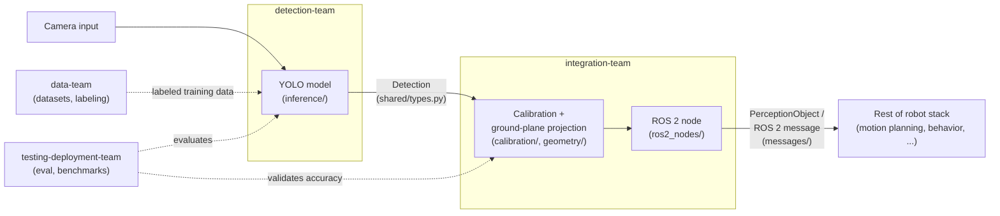

# Architecture

This describes how the four subteams' work fits together into one
perception pipeline, from camera frame to a position the rest of the
robot stack can act on.

## Pipeline status

What's actually implemented today, not the roadmap:

| Stage | Status | Notes |
|---|---|---|
| Shared types & config (`shared/`) | **Working** | `BoundingBox`, `Detection`, `Position2D`, `PerceptionObject` dataclasses and the YAML config loader are implemented and usable — see [Data contracts](#data-contracts) below. |
| Data pipeline (`data-team/`) | **Not started** | `scripts/download.py`, `convert.py`, `split.py`, `augment.py` exist as CLI skeletons (argument parsing only, bodies raise `NotImplementedError`). No dataset has been downloaded or processed yet. |
| Detection (`detection-team/`) | **Not started** | `training/train.py`, `training/eval.py`, `inference/detector.py` are skeletons; no model has been trained. [`scripts/quickstart.py`](scripts/quickstart.py) at the repo root runs a stock pretrained YOLO model directly as a stand-in — see its docstring for exactly what that does and doesn't prove. |
| Calibration (`integration-team/calibration/`) | **Not started** | `calibrate.py` is a skeleton; no camera has been calibrated. |
| Ground-plane projection (`integration-team/geometry/`) | **Not started** | `projection.py` is a skeleton. |
| ROS 2 packaging (`integration-team/ros2_nodes/`, `messages/`) | **Not started** | Node files and the message-conversion stub exist; no ROS 2 message schema has been defined yet. |
| Evaluation & benchmarking (`testing-deployment-team/`) | **Not started** | `tests/eval_harness.py`, `benchmarks/inference_speed.py`, `deployment/export_onnx.py` are skeletons. |

> **Keep this current:** if you implement a stage, update its row in
> this table in the same PR. A stale status table is worse than none.

## Pipeline overview

1. **Camera input** — a frame comes off the SUSTAINA-OP2's onboard
   camera.
2. **Detection** ([detection-team/](detection-team/)) runs the trained
   YOLO model on the frame and produces bounding-box detections (class,
   confidence, image-space box) for the ball, robots, goalposts, field
   lines, and landmarks. See [Data contracts](#data-contracts) below for
   the exact `Detection` shape.
3. **Integration** ([integration-team/](integration-team/)) takes those
   detections and, using camera calibration and a ground-plane
   projection, converts each one into a robot-relative position. See
   [Data contracts](#data-contracts) for the exact `PerceptionObject`
   shape.
4. **Output** — integration-team publishes the resulting positions as
   ROS 2 perception messages, which the rest of the robot stack (motion
   planning, behavior, etc.) subscribes to. **This message format isn't
   defined yet** — see [Data contracts](#data-contracts).

Data-team ([data-team/](data-team/)) feeds detection-team with labeled
training data throughout, and testing-deployment-team
([testing-deployment-team/](testing-deployment-team/)) evaluates and
benchmarks both the detection model and the calibration/projection math,
and packages the final result.

As the [Pipeline status](#pipeline-status) table above shows, this is
currently the intended design, not a description of working code — see
that table for what's actually implemented.

## Data contracts

These are the types every subteam should import rather than
redefining, from [`shared/types.py`](shared/types.py). This file is
real, implemented code (not a stub).

**`BoundingBox`**

| Field | Type | Description |
|---|---|---|
| `x_min` | `float` | Left edge, in image pixels |
| `y_min` | `float` | Top edge, in image pixels |
| `x_max` | `float` | Right edge, in image pixels |
| `y_max` | `float` | Bottom edge, in image pixels |

**`Detection`** — raw output from the detection model, in image space

| Field | Type | Description |
|---|---|---|
| `class_name` | `str` | One of `shared/classes.py`'s `CLASSES`: `ball`, `robot`, `goalpost`, `field_line`, `landmark` |
| `confidence` | `float` | Model confidence score, 0–1 |
| `bbox` | `BoundingBox` | Image-space bounding box |

**`Position2D`** — robot-relative position on the ground plane, in
meters

| Field | Type | Description |
|---|---|---|
| `x` | `float` | Meters, robot-relative. **Axis convention (which direction is +x, origin point) is not yet defined** — TODO for integration-team when ground-plane projection is implemented. |
| `y` | `float` | Meters, robot-relative. Same caveat as `x`. |

**`PerceptionObject`** — a `Detection` projected into robot-relative
world coordinates

| Field | Type | Description |
|---|---|---|
| `class_name` | `str` | Carried over from the source `Detection` |
| `confidence` | `float` | Carried over from the source `Detection` |
| `position` | `Position2D` | Projected ground-plane position |

**ROS 2 perception message:** **not yet defined.**
[`integration-team/messages/perception_message.py`](integration-team/messages/perception_message.py)
has a `to_ros_message(obj: PerceptionObject)` function stub, but no
actual ROS 2 message type/schema has been created — no `.msg` file, no
field list beyond what `PerceptionObject` already has above. Owned by
integration-team, planned for November (see
[integration-team/README.md](integration-team/README.md#semester-roadmap)).
Once it exists, its fields should be documented here.

## Diagram

## Where each subteam's code plugs in

| Stage | Subteam | Folder |
|---|---|---|
| Provide training data | data-team | `data-team/datasets/`, `data-team/scripts/` |
| Produce detections | detection-team | `detection-team/training/`, `detection-team/inference/` |
| Project to robot-relative positions | integration-team | `integration-team/calibration/`, `integration-team/geometry/` |
| Publish to the robot stack | integration-team | `integration-team/ros2_nodes/`, `integration-team/messages/` |
| Evaluate and package | testing-deployment-team | `testing-deployment-team/tests/`, `testing-deployment-team/benchmarks/`, `testing-deployment-team/deployment/` |
| Cross-cutting types/constants | shared | `shared/` |

See each subteam's own README for its semester roadmap and current
starting task.

## Glossary

Unfamiliar term (TORSO-21, mAP, ROS 2 node, ONNX, ...)? See
[GLOSSARY.md](GLOSSARY.md).
